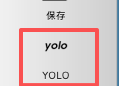

# 安装使用labelImg进行数据标注

我们将使用 **LabelImg** 这个最流行、最简单的开源工具来完成。它是一个桌面应用程序，非常适合初学者。

这个过程虽然是整个项目中**最耗时、最需要耐心**的一步，但它的质量**直接决定了你模型性能的上限**。

## 1. 安装 LabelImg

LabelImg 是一个基于 Python 的桌面应用程序，用于图像标注。它支持多种标注格式，包括 YOLO、PascalVOC、Rectangles 等。

最简单的方式是通过 `pip` 安装。请在您的终端或命令行中运行：

```bash
pip install labelimg
```

因为依赖项冲突和过时的构建方式导致失败（python3.13.1），所以直接从 GitHub 安装，通过 PyQt5 + 直接运行源码。

### github安装过程：

- 克隆仓库： `git clone https://github.com/HumanSignal/labelImg.git`
- 进入仓库目录： `cd labelImg`
- 安装依赖： `pip install pyqt5 lxml`
- 将PyQt的资源文件（.qrc）编译成Python模块： `pyrcc5 -o libs/resources.py resources.qrc`
- 运行 LabelImg： `python labelImg.py`
- 在主界面进行数据标注操作

## 2. 文件结构

在开始标注之前，请建立一个清晰的文件夹结构，这将使后续的训练过程变得非常简单。

```
C:/my_project/
└── dataset/
    ├── images/            <-- 把你所有的截图都放在这里 (例如 screenshot1.jpg, screenshot2.jpg)
    ├── labels/            <-- 这个文件夹现在是空的，用来存放标注好的文件
    └── predefined_classes.txt  <-- 我们将创建这个文件来预定义类别
```

## 3. 创建类别预定义文件

在 `dataset` 文件夹下，创建一个名为 `predefined_classes.txt` 的文本文件。这个文件的作用是让你在标注时可以直接选择类别，而不用每次都手动输入，可以避免打错字。

文件内容只有两行：（因人、项目需求而异）

```
label
value
```

---

## 4. 设置标注格式为 YOLO (至关重要！)
我们的目标是训练 YOLO 模型，所以必须使用它要求的标注格式。

1.  点击左侧菜单栏的 **"PascalVOC"** 按钮。
2.  在弹出的选项中，选择 **"YOLO"**。



## 5. 打开图片和指定保存目录

1.  **打开图片目录**: 点击左侧菜单的 **"打开目录"** 按钮，然后选择你之前创建的 `dataset/images/` 文件夹。
2.  **指定保存目录**: 点击左侧菜单的 **"改变存放目录"** 按钮，然后选择 `dataset/labels/` 文件夹。

现在，第一张图片会自动加载到主窗口，右下角的文件列表会显示 `images` 文件夹里的所有图片。

## 6. 数据标注步骤：

1.  **创建矩形框**:
    *   按下键盘快捷键 **`W`** (Create RectBox 的意思)。
    *   你的鼠标会变成一个十字准星。
    *   移动到你想要标注的对象的左上角，**按住鼠标左键，拖动** 到对象的右下角，然后松开。一个矩形框就画好了。

2.  **选择类别**:
    *   松开鼠标后，会立刻弹出一个让你选择类别的对话框。
    *   因为我们已经预定义了类别，所以你只需**点击选择 `label` 或 `value`**，然后点击 "OK"。

    **操作示例：**
    *   按下 `W`，在 "体重" 两个字周围画一个框。
    *   在弹出的窗口中选择 **`label`** 并点击 "OK"。
    *   再次按下 `W`，在 "61.70 公斤" 周围画一个框。
    *   在弹出的窗口中选择 **`value`** 并点击 "OK"。

     (这是一个标注过程的动画示意图)

3.  **重复操作**: 对当前图片上**所有**需要识别的 `label` 和 `value` 重复上述 `画框 -> 选类别` 的操作。

4.  **保存**: 当一张图片上的所有对象都标注完成后，按下键盘快捷键 **`Ctrl + S`** 来保存。此时，在你的 `dataset/labels/` 文件夹下，会自动生成一个与图片同名的 `.txt` 文件 (例如 `screenshot1.txt`)。这个文件里就包含了你刚才画的所有框的位置和类别信息。


## 7. 快捷键

*   `W`: 创建矩形框
*   `Ctrl + S`: 保存
*   `D`: 下一张图片
*   `A`: 上一张图片
*   `Ctrl + Z`: 撤销上一步操作
*   方向键: 微调选中框的位置
*   `Ctrl` + 方向键: 微调选中框的大小
*   `shift + Command（⌘）+ F`: 缩放到当前画面一样宽（适当扩大需要标注区域，会好操作一点）
*   `Command（⌘）+ -`: 缩小图片
*   `Command（⌘）+ +`: 放大图片

##  8. 标注的最佳实践和技巧

为了训练出高质量的模型，请务必遵守以下原则：

1.  **紧凑性 (Tightness)**: 你的标注框应该**尽可能紧密地包裹住目标文本**，不要留有太多空白边缘。
    *   **好**: `[体重]`
    *   **不好**: `[   体重   ]`

2.  **一致性 (Consistency)**: 对所有图片使用完全相同的标注标准。
    *   例如，你决定将 "61.70 公斤" 作为一个整体标注为 `value`，那么在所有图片中，类似 "1395 大卡" 也应该被作为一个整体标注，而不是分成 "1395" 和 "大卡" 两个框。

3.  **完整性 (Completeness)**: **不要漏掉任何一个目标**。一张图片里有多少个需要识别的 `label` 和 `value`，你就必须画多少个框。

## 9. 检查输出结果

标注完成后，打开 `dataset/labels` 文件夹会看到：

1. **一系列 `.txt` 文件**: 每个文件的名字都与 `images` 文件夹中的图片名一一对应。例如，`report_01.jpg` 的标注文件就是 `report_01.txt`。

2. **`classes.txt` 文件**: LabelImg 会自动生成这个文件。它定义了您的类别名称和ID的映射关系。打开它会看到：

    ```
    label
    value
    ```
    这表示 `label` 的类别ID是 `0`，`value` 的类别ID是 `1`。 
    
    > 💡**<font color='red'>重要提醒</font>：类别ID必须从0开始！**


3. **单个标注文件的内容**: 打开任意一个 `.txt` 文件，例如 `report_01.txt`，内容会是这样的：

    ```
    0 0.15345 0.28432 0.08123 0.03456
    1 0.78945 0.28432 0.15678 0.03456
    0 0.15345 0.35432 0.09123 0.03456
    1 0.78945 0.35432 0.05123 0.03456
    ...
    ```
    每一行代表一个边界框，格式为：`[类别ID] [框中心X坐标] [框中心Y坐标] [框宽度] [框高度]`。所有坐标值都经过了归一化处理（即值在0到1之间）。

完成以上所有步骤后，我们已经成功地创建了一套可用于训练YOLO模型的高质量标注数据集，可以直接用于下一阶段的模型训练。`dataset` 文件夹里面的 `images` 和 `labels` 子文件夹包含了模型训练所需的一切。